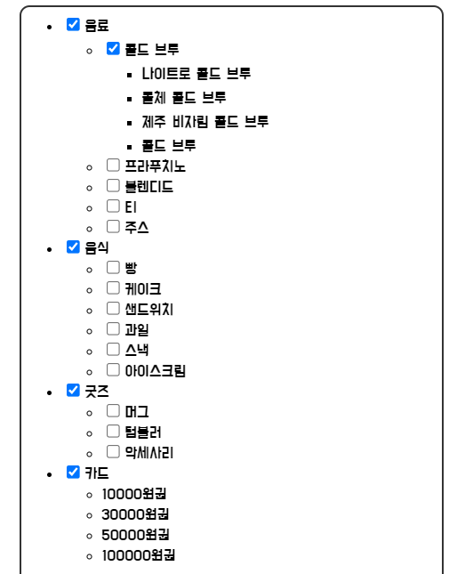

### Json.stringify

* `JSON.stringify` : 객체를 JSON으로 변환한다.

JSON으로 변환된 객체의 타입은 문자열이다.

* `JSON.parse` : JSON을 객체로 변환한다.

### JSON의 기본 규칙

||자바스크립트 객체|JSON|
|------|---|---|
|키|키는 따옴표 없이 쓸 수 있음 <br> `{ key : "property" }`|반드시 쌍따옴표를 붙여야 함 <br> `'{"key":"property"}'`|
|문자열 값|작은따옴표도 사용 가능 <br> `{ "key" : 'property' }`|반드시 큰따옴표로 감싸야 함 <br> `'{"key":"property"}'`|
|키와 값 사이 공백|	사용 가능 <br> `{"key" : 'property'}`|사용 불가능 <br> `'{"key":"property"}'`|
|키-값 쌍 사이 공백|사용 가능 <br> `{ "key":'property', num:1 }`|사용 불가능 <br> `'{"key":"property","num":1}'`|

<br>

### stringifyJSON

#### stringifyJSON.js
---

```js
function stringifyJSON(obj) {
  // your code goes here
  if(obj == null){
    return "null";
  }
  if (typeof obj === 'number'){
    return String(obj);
  }
  if (typeof obj === 'boolean'){
    return String(obj);
  }
  if (typeof obj === 'string'){
    return `"${obj}"`  
  }
  if (Array.isArray(obj)){
    let result = ''
    for(let el of obj){
      result += stringifyJSON(el) + ','
    }
    result = result.slice(0, -1)
    return `[${result}]` 
  }
  if (typeof obj === 'object'){
    let result = ''
    for(let i in obj){
      if(obj[i] === undefined || typeof obj[i] === "function"){
        continue // skip
      }
      result += `${stringifyJSON(i)}:${stringifyJSON(obj[i])},`
    }
    result = result.slice(0, -1)
    return `{${result}}` 
  }
};
```

초반에 숫자, boolean, 문자열을 문자열로 반환한다. 배열일 때를 보면 `stringifyJSON(el)`로 재귀함수를 호출하고 있다. 재귀함수로 호출하는 이유는 배열 안 요소가 문자열인지 숫자인지 다시 판단할 필요 없다.

객체일 때도 마찬가지이다. key와 value를 재귀함수로 호출하고 있다.

<br>

### Tree UI



위 사진처럼 자식 노드가 있는 경우, 재귀함수로 반복되는 `<ul>` 호출해야한다. 만약 자식 노드가 없는 경우 `<li>`에 이름을 넣으면 된다. 

#### fix_me.js
---

```js
const root = document.getElementById('root');
function createTreeView(menu, currentNode) {

  for(let i =0; i<menu.length; i++){
    const li = document.createElement("li") // 
    // 자식 노드가 있는 데이터의 경우
    if(menu[i].children){
      const input = document.createElement("input");
      input.setAttribute("type","checkbox");
    
      const span = document.createElement("span");
      span.textContent = menu[i].name;

      const ul = document.createElement("ul");
      // 자식 메뉴가 있다면 재귀 함수 호출
      createTreeView(menu[i].children, ul);
      li.append(input, span,ul);
      currentNode.append(li) //li를 root에 추가
    }

    // 자식 노드가 없는 데이터의 경우
    else {
      li.textContent = menu[i].name
      currentNode.append(li)
      }
    } 
}

createTreeView(menu, root);
```