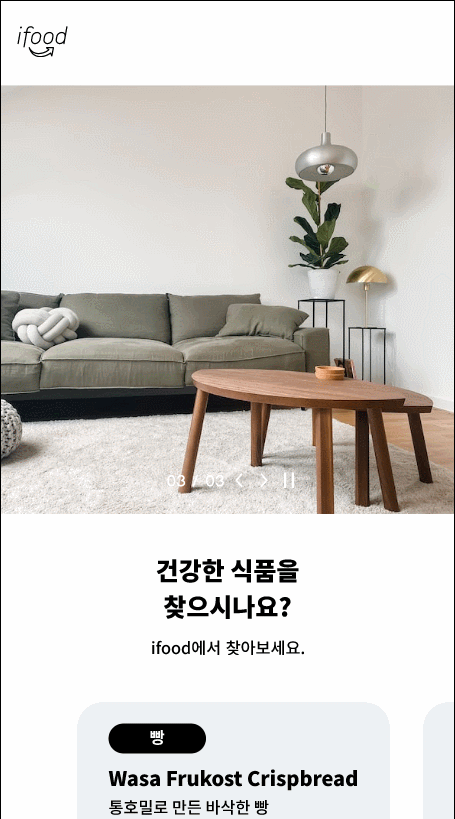

Figma를 사용해서 기존 운영중인 서비스의 화면의 디자인을 따라서 만들어 보자.

 

## 과제1 - Toss 앱 클론
---

페어와 함께 토스 앱의 디자인을 따라해보았다. 따라하면서 어려웠던 부분, 부족한 부분, 느낀점에 대해 얘기해보려 한다.

### 어려웠던 내용 🤢
---

* **오버레이로 창 띄우기(팝업창)**

주식에서 추가하기를 누르거나 오늘의 발견에서 하트를 누르면 아래와 같은 결과가 나와야 한다.

처음에 주식화면을 가져와 투명도 있는 검은 배경과 팝업을 추가했다. 문제는 Move in을 적용하면 검은 배경까지 이동하기 때문에 생각한 결과가 나오지 않았다.

그래서 해결하기 위해 아래와 같이 팝업화면은 배경을 없애고 필요한 팝업창만 구현하였다. 그리고 주식 화면에서 **Open overlay**를 적용해 주식화면 위에 팝업을 띄우도록 바꿨다.

###

* **이미지 자동 넘기기**

필요한 사진을 하나의 프레임으로 묶는다. 참고로 Clip content를 선택하면 프레임 상에서 어떤 이미지가 뜨는지 알 수 있다. 프레임을 필요한 만큼 복제해 해당 이미지가 나타날 수 있게 변경해준다. 후에 모든 프레임을 선택하여 Component 오른쪽 drop down을 클릭해 Create component set을 눌러준다. 

컴포넌트 안 각 이미지에 After delay를 적용해 change to로 **다음 이미지**로 넘어갈 수 있도록 설정해준다. 

**결과 화면**

 

### 부족한 내용 🧐
---

과제를 하면서 아쉬운 것들은 없다. 이틀에 걸쳐 만들었기 때문에 만들고 싶은 화면은 다 구현한 것 같다!

 

### 느낀점 🤠
---

Figma로 프로토타입을 구현하면서 실제와 비슷한 앱을 만들 수 있어서 좋았다. 프로토타입만 잘 작성해도 화면 구성과 사용자 흐름(user flow)을 개선함으로써 좋은 UI, 좋은 UX를 디자인할 수 있어 최종 결과물의 완성도를 향상시킬 수 있다는 것을 알게 되었다. 또한 프로젝트 기획 내용을 직관적으로 전달할 수 있어 내부 인원은 물론 프로젝트 외부 인원과의 소통에도 큰 도움이 될 것이라는 것도 알게 되었다. 

나중에 직접 프로젝트를 기획부터 시작할 일이 생긴다면, 기획 단계에서 완성도 있는 프로토타입을 만들기 위해 Figma를 익숙하게 다룰 수 있도록 열심히 연습해야 겠다.