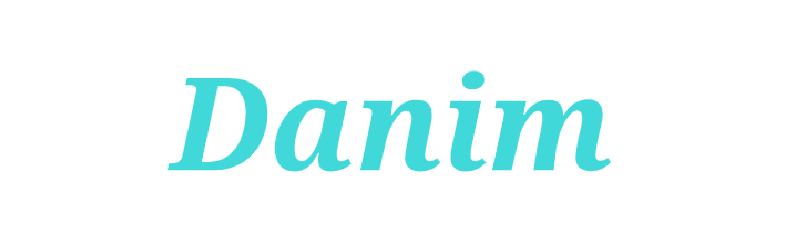
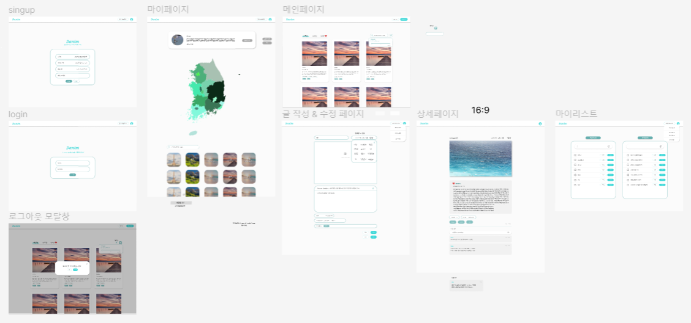
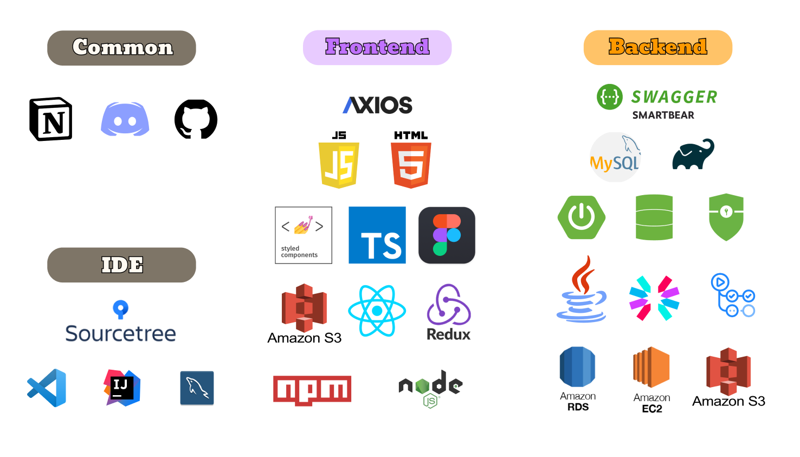

2주간의 프리 프로젝트를 마무리하고, 오늘부터 프론트 3명, 백엔드 3명이 모여 총 6명으로 메인 프로젝트를 시작했다.

 

### 진행순서

화면 정의서 -> 요구사항 정의서 -> 개발 -> 서버 연동 테스트 -> 빌드 -> 오류수정 -> 배포 순으로 진행할 예정이다.

## 1. Danim🌴

---

 

 

아이디어 회의를 통해 최종적으로 국내 여행 일기 서비스를 구현하기로 결정했다. 다님이라는 단어는 여행의 순우리말이다.
전반적인 서비스 내용은 사용자가 여행 일기를 작성하면 다른 사용자에게 해당 게시물이 보여지게 된다.
해당 게시물을 본 다른 사용자에게는 여행지 추천이 될 수 있다.

### 서비스 소개

기록을 남기지 않은 여행은 희미해지고, 기록을 남긴 여행은 추억 선명해진다.

우리의 아이덴티티는 지도이다. 마이페이지로 이동하면 지도에는 자신이 방문한 지역의 빈도수에 따라 색 채도가 달라진다.
예를 들어, 가장 많이 방문한 지역은 색이 진해질 것이고, 가장 적게 방문한 지역은 색이 옅어질 수 있도록 적용할 예정이다.

여행을 기록하면, 추억이 선명해진 것처럼 해당 지역의 일기를 많이 작성할수록 우리 서비스의 핵심인 지도의 색도 진해진다는 의미를 담아 국내 여행 일기 서비스를 제작하게 되었다.

 

## 2. 역할 분담

---

먼저 프론트에서 쓰이는 버튼, input 등 공통적인 컴포넌트를 팀원들과 나눠서 제작하고,
이후에 나는 마이리스트 페이지, 로그인페이지, 회원가입 페이지, 헤더 & 로그아웃 & 삭제 & 취소 모달 창, 메인페이지 필터 모달 창, 로딩 이미지& 스켈레톤 적용 등 맡기로 했다.
물론 서버 통신까지 책임지고 구현할 예정이다!
만약, 맡은 역할이 모두 끝나면 다른 팀원들을 도와주기로 했다.

 

## 3. 구조설계

---

### 클라이언트

 

 

피그마를 이용해 프론트 팀원들과 클라이언트를 설계하였고, 필요에 따라 화면을 수정하면서 진행할 예정이다.

 

### 사용스택

 

 

## ✔️ 마무리

---

우리 팀 git 원격 레포지토리를 fork한 다음, 내 로컬에서 개발하고 PR하여 머지할 예정이다. 이후에 개발 환경을 셋팅하고, 개발을 시작할 예정이다.

마지막 날까지 좋은 결과를 위해서 열심히 개발하자!!

아! 제목 위 이모지가 teeth인 이유는 이를 갈고 열심히 해보겠다는 의미로 넣어놨다 ㅎ
