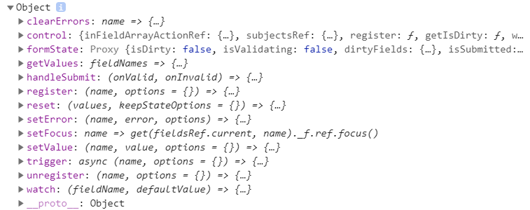
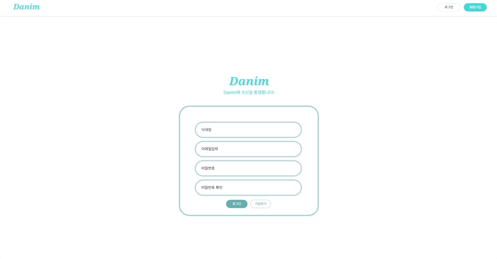

## react-hook-form

[react-hook-form](https://react-hook-form.com/)

react-hook-form을 선택한 이유는 React 내에서 Form을 쉽게 제어하고 손쉽게 유효성 검사를 처리하도록 도와주기 때문이다.

<br>

실제로 React Hook Form을 사용하면서 value와 onChange로 각 입력 필드에 대한 처리를 추가할 필요가 없었다. 또한, state를 직접 관리할 필요도 없었다.

<br>

## react-hook-form 을 이용해서 유효성검사

---

```js
const useform = useForm();
console.log(useform);
```

###

실제로 콘솔을 확인해보면

###



###

React Hook Form은 form 작업에 사용할 수 있는 useForm hook을 제공한다. 아래 코드를 통해서 살펴보겠습니다.

<br>

## Signup.js

---

```js
const {
  register,
  handleSubmit,
  formState: { errors },
  watch,
} = useForm();

  const currentPassword = useRef({});
  currentPassword.current = watch("password", "");

  ...

  return (
    <>
      <ShortInput
        {...register("password", {
            required: true,
            minLength: {
            value: 8,
            message: "최소 8자 이상의 숫자를 입력해주세요.",
            },
            pattern: {
            value: /^(?=.*?[a-z])(?=.*?[0-9])(?=.*?[~?!@#$%^&*_-]).{8,}$/,
            message: "영문, 숫자, 특수문자를 혼합 사용하여 순서대로 주세요.",
            },
        })}
        type="password"
      />
    </>
  )
```

### 💿 register

useForm()에서 구조분해할당을 통해 register, watch 를 꺼냈다.

register는 `name`, `options`를 가지는데, 위 코드에서 `name`은 "email"이고, `options`는 위와 같습니다.

### 💿 watch

currentPassword.current를 통해 현재 입력한 비밀번호를 확인할 수 있다.
watch()를 사용하여 input값의 value를 확인할 수 있다.

<br>

### 💿 handleSubmit

```js
const onValid = async (data) => {
  const postSignup = {
    nickname: data.nickname,
    email: data.email,
    password: data.password,
  };

  // 회원가입 요청
  const res = await useFetch('POST', `/auth/register`, postSignup);
};

const onInValid = (error) => {
  console.log('error', error);
};

return (
  <>
    <InputContainer onSubmit={handleSubmit(onValid, onInValid)}>...</InputContainer>
  </>
);
```

handleSubmit을 사용하면 제출 시 새로고침 현상이 일어나지 않는다. 즉, event.preventDefault()를 하지 않아도 된다.

제출 했을 때 form이 유효하다면 onValid가 실행되고, 유효하지 않다면 onInvalid가 실행된다.

<br>

### 💿 formState

```js
const {
  formState: { errors },
} = useForm();

return (
  <>
    <ShortInput
      {...register('password', {
        required: true,
        minLength: {
          value: 8,
          message: '최소 8자 이상의 숫자를 입력해주세요.',
        },
        pattern: {
          value: /^(?=.*?[a-z])(?=.*?[0-9])(?=.*?[~?!@#$%^&*_-]).{8,}$/,
          message: '영문, 숫자, 특수문자를 혼합 사용하여 순서대로 주세요.',
        },
      })}
      type="password"
    />
    {errors.password && <ErrorMSG role="alert">{errors.password.message}</ErrorMSG>}
  </>
);
```

formState 의 errors를 사용하면 훨씬 더 간편하게 error를 검출할 수 있다.

비밀번호 유효성 검사가 틀리면 에러 메시지를 출력한다.

<br>

## 회원가입

---



<br>
<br>

로그인 페이지도 회원가입과 동일하게 React Hook Form을 사용해서 구현했다.

## 로그인

---


